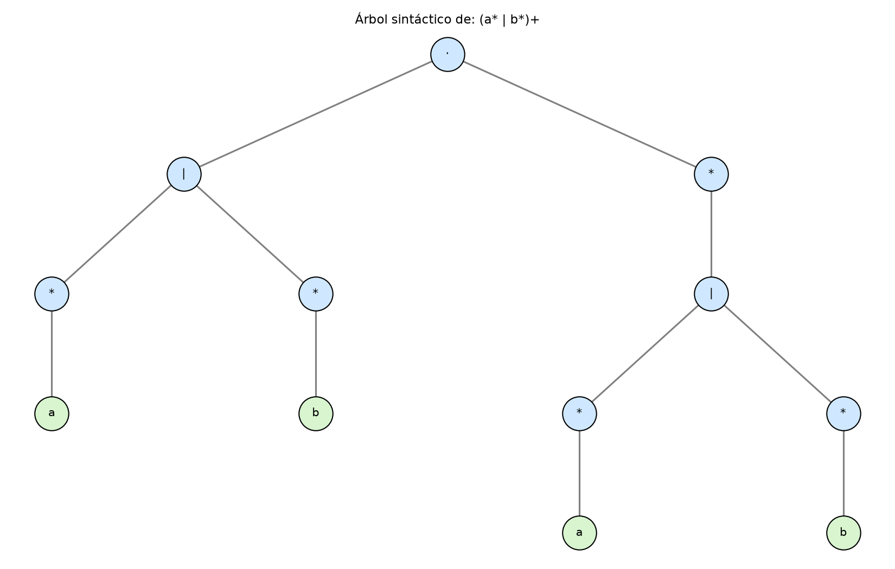
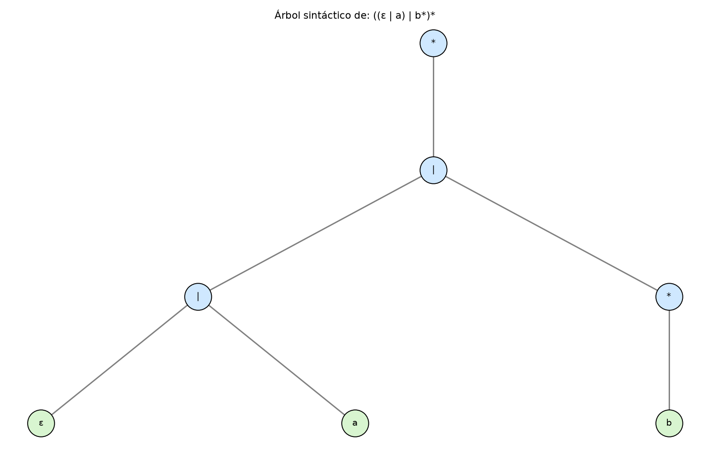
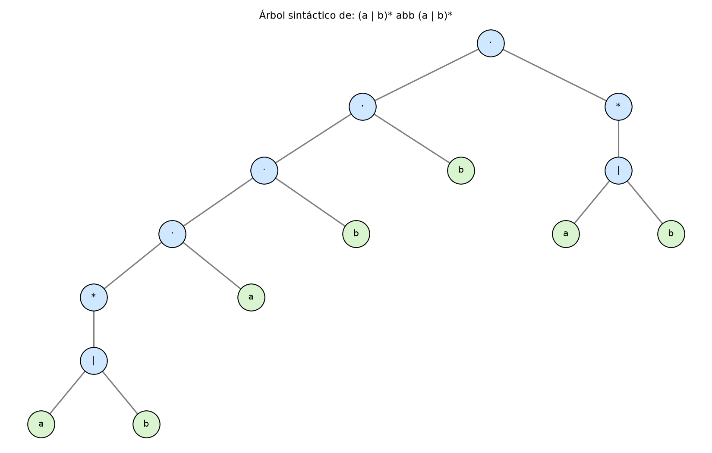
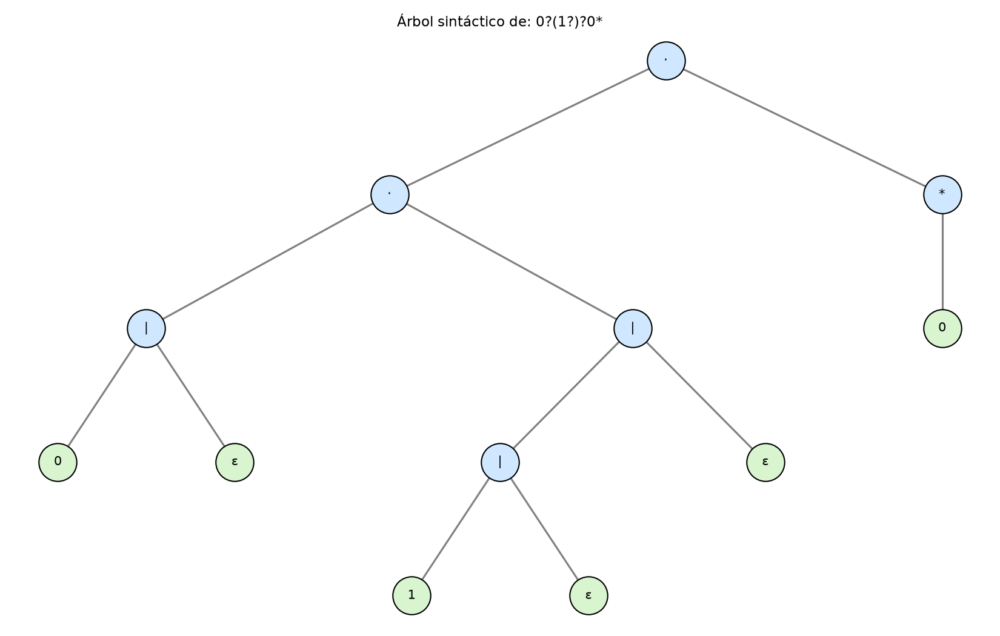

# Lab3 — Shunting Yard y Árbol Sintáctico de Expresiones Regulares

## Contenido

- `shunting_yard.py` — Problema 1 (laboratorio anterior): convierte expresiones
  regulares de infix a postfix, mostrando cada paso del algoritmo.
- `arbol_sintactico.py` — Problema 1 (este laboratorio): reutiliza
  `shunting_yard.py` para construir y dibujar el árbol sintáctico a partir de
  la postfix, aplicando la simplificación de `+` (→ `r·r*`) y `?` (→ `r|ε`).
- `expresiones_arbol.txt` — archivo de expresiones de ejemplo (una por línea).
- `explicacion_shunting_yard.md` — explicación escrita de cómo funciona el
  algoritmo de Shunting Yard.

## Requisitos

```
pip install matplotlib
```

## Ejecución

Ambos scripts deben estar en la misma carpeta (uno importa al otro).

```
python shunting_yard.py expresiones_arbol.txt
python arbol_sintactico.py expresiones_arbol.txt
```

El segundo comando genera, además de la salida en consola, un archivo
`arbol_N.png` por cada expresión procesada, con el árbol sintáctico dibujado.

## Árboles generados

|  |  |
|:---:|:---:|
|  |  |

# Link del Video
https://uvggt-my.sharepoint.com/:f:/g/personal/san231221_uvg_edu_gt/IgCWhBNXNPXIQJfuNAPQThFiAVKt2OLLmZh6wyr_VqMlIr0?e=HI7DOW
